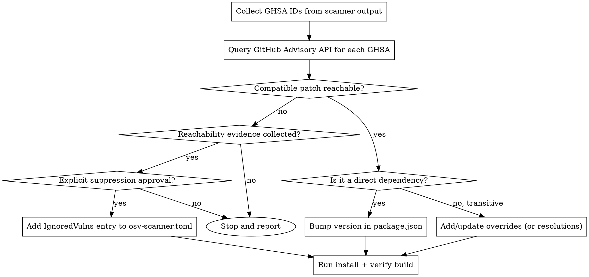

# Fix OSV Vulnerabilities

## Overview

For each reported GHSA, check if a patched version exists via the GitHub Advisory API.
If a patch exists → upgrade via package manager overrides or direct dependency bump.
If no compatible reachable patch exists → collect reachability evidence and request a suppression decision.

The unit of work is one repository.
An alert that arrives by e-mail or as a GitHub Advisory link is the same input as a scanner finding once its GHSA id is known; an account-wide sweep hands over one row per alert and this skill takes each repository's rows from there.
The override mechanics below are written for the JS package managers because that is where the multi-major trap lives; the other ecosystems get the same triage and a one-line upgrade command each.

## Workflow



## Step 1 — Collect the alerts

If the repo has Dependabot enabled, one call gets every open alert with its advisory data already joined — prefer this over scraping scanner output:

```bash
gh api --paginate repos/<owner>/<repo>/dependabot/alerts \
  --jq '.[] | select(.state=="open") | {ghsa: .security_advisory.ghsa_id, pkg: .dependency.package.name, scope: .dependency.scope, severity: .security_advisory.severity, range: .security_vulnerability.vulnerable_version_range, patched: .security_vulnerability.first_patched_version.identifier}'
```

`--paginate` is not optional. Without it the endpoint returns only the first 30 alerts, oldest first, and the result looks like a complete list: 505 open alerts once read as ~110. In a polling loop it is worse than incomplete — every newly filed alert lands on a page you never fetch, so the watch goes silently blind.

To look up a single GHSA (e.g. one that came from `osv-scanner` output):

```bash
gh api advisories/GHSA-XXXX-XXXX \
  --jq '"\(.ghsa_id) [\(.severity)] \(.summary)", (.vulnerabilities[] | "    \(.package.name): affected=\(.vulnerable_version_range)  patched=\(.first_patched_version // "NO PATCH")")'
```

Key field: `first_patched_version` — if present, a safe version exists.

Two shape gotchas that will bite you:

- On the **advisories** endpoint `first_patched_version` is a plain **string**; on the **dependabot/alerts** endpoint it is an **object** with an `.identifier` key. Using the wrong one fails with `expected an object but got: string`.
- One advisory often lists **several** `vulnerabilities` entries — one per affected major line (e.g. `<= 7.29.0 → 7.29.6` and `>= 8.0.0-alpha.0, < 8.0.0-rc.5 → 8.0.0-rc.6`). Pick the entry matching the major you are actually on; do not grab the first one and jump a major.

Do not pipe `curl` into `python3`/`node` to parse this — the `dangerous-command-guard` hook blocks piping downloaded content into an interpreter. `gh api --jq` avoids the problem entirely.

### Let GitHub open the mechanical ones

Before hand-fixing a within-major patch, check whether the repository has Dependabot security updates switched on:

```bash
gh api repos/<owner>/<repo>/automated-security-fixes --jq .enabled
gh api -X PUT repos/<owner>/<repo>/automated-security-fixes   # enable (repository setting — announce before running)
```

With it enabled, GitHub opens the PR for every alert whose fix stays inside the installed major, and this skill is only needed for what Dependabot cannot do: a fix that crosses a major, several majors of one package, a transitive override, or a suppression decision.
A repository without a `.github/dependabot.yml` also has no version-update or `github-actions` monitoring at all, which shows up as a wall of stale actions rather than as alerts — add the config in its own PR, separate from the version bumps.

### Two lockfiles double every alert

`turbo-flutter-log` carried both `pnpm-lock.yaml` and `package-lock.json`; `receipt_preprocessor` carries both `uv.lock` and an exported `requirements.txt`.
Dependabot files one alert per manifest, so every finding appears twice and the count overstates the work.
Group the rows by `dependency.manifest_path` first, fix the lockfile that the project actually installs from, then regenerate the derived file from it (or delete the stray one) so both alerts close from a single change.

## Step 2a — Patch available: apply upgrade

### Transitive dependency (pnpm)

Add or update `overrides` in **`pnpm-workspace.yaml`** at the repo root — not `package.json`:

```yaml
overrides:
  "@babel/core": "^7.29.6" # GHSA-XXXX-XXXX
  package-name: "^<patched-version>" # GHSA-YYYY-YYYY
```

Current pnpm **ignores the `pnpm` field in `package.json`** and only warns:

```log
[WARN] The "pnpm" field in package.json is no longer read by pnpm.
The following keys were ignored: "pnpm.overrides". See https://pnpm.io/settings
```

That warning is easy to miss in install output, and the install then "succeeds" having changed nothing — always confirm the resolved versions (below) rather than trusting a clean exit code.
Verified on pnpm 11.13.0 (2026-07-19); older pnpm 9/10 did read `pnpm.overrides` from `package.json`, so check `pnpm --version` if a repo still uses the old layout.

Annotate each entry with its GHSA id so a future reader knows when the override can be dropped.

Use `^<patched-version>` so pnpm resolves to the latest compatible patch — often ends up installing a newer safe release.
Note that for `0.x` packages `^0.28.1` means `>=0.28.1 <0.29.0`, which is still the right choice.

For npm: use `"overrides"` in `package.json` (npm 8+).
For yarn: use `"resolutions"` in `package.json`.

### Several majors of the same package

One "highest patched version" per package name is wrong whenever the tree holds several majors of that package — the override either drags old consumers across a breaking boundary, or hides a reachable fix behind an unreachable one.
Match each advisory's `vulnerable_version_range` against the versions **actually installed**, and take the highest patch within each installed major.

- **Write one entry per major, never a merged one.** pnpm and yarn berry accept major-scoped selectors: `minimatch@3: ^3.1.4` _and_ `minimatch@9: ^9.0.7`. A blanket `undici: ^6.27.0` once silently downgraded a pinned `undici@7.28.0`.
- **The inverse bites too.** Keeping only the maximum patched version can discard the actionable fix: `fast-xml-parser` had advisories patched at 4.5.4/4.5.5 (reachable from the installed 4.5.3) plus one whose only fix is 5.7.0. Because the `< 5.7.0` range also matches 4.5.3, deduping to the max threw away the reachable 4.x fixes and four alerts stayed open until the override was scoped to `fast-xml-parser@4`.
- **Yarn classic (v1) does support scoped overrides** — the key is the literal dependency chain from `yarn why <pkg>`, e.g. `"glob/minimatch/brace-expansion": "^2.1.3"`. A flat unscoped key is dangerous here because yarn classic merges every semver request for that name into one resolution. The tell is a single lockfile stanza carrying combined ranges (`^1.1.17, ^2.0.2, ^5.0.5`) — that means the override leaked across majors, so revert and re-scope.
- **Preserve the lockfile by default.** An incremental install after editing `resolutions` can leave a stale stanza untouched. Do not delete or replace the lockfile during routine triage. A fresh regeneration can change unrelated resolutions. Require explicit approval before an isolated fresh regeneration in a clean worktree.
- **When two majors have incompatible export shapes, do not force one onto the other.** `brace-expansion` 2.x is `module.exports = expandTop` while 5.x is `{ expand }`. If no compatible reachable patch exists, continue to Step 2b. Do not add an `[[IgnoredVulns]]` entry before collecting the required evidence and obtaining explicit approval.

Verify per major, without truncation: re-run `yarn why` / `pnpm why` and diff the lockfile for each major line.

Use the package manager's normal install only when an approved dependency change needs a lockfile update.
Treat a fresh regeneration from no lockfile as a separate operation that requires explicit approval.

### Direct dependency

Bump the version in the relevant workspace `package.json` directly:

```json
"devDependencies": {
  "vite": "^7.3.2"
}
```

### Apply and verify

```bash
pnpm install --no-frozen-lockfile   # Changing overrides is a lockfile config change
pnpm build                          # Confirm build passes
```

`--no-frozen-lockfile` is required: with `CI=true` (or on CI) a plain `pnpm install` aborts with `ERR_PNPM_LOCKFILE_CONFIG_MISMATCH` because the new `overrides` block does not match the one recorded in the lockfile.
Prefixing `CI=true` also avoids `ERR_PNPM_ABORTED_REMOVE_MODULES_DIR_NO_TTY` when pnpm wants to purge `node_modules` in a non-interactive shell.

Confirm the resolved versions are ≥ the patched versions — this is the real proof the fix landed, not the install exit code:

```bash
pnpm why <pkg-a> <pkg-b> --depth 1
```

Watch the `Found N versions of <pkg>` line: an override that worked usually collapses a package to a **single** version by pulling a parent off its exact pin.

Map each override to a check that actually executes it, rather than assuming `pnpm build` covers everything:

| Override lives in                    | Exercised by                                    |
| ------------------------------------ | ----------------------------------------------- |
| CSS pipeline (postcss, autoprefixer) | `pnpm build`                                    |
| Lint/AST tooling (`@babel/core`)     | `pnpm lint` — a Next build uses SWC, not Babel  |
| Script runner (`esbuild` via tsx)    | the test/script command that runs through `tsx` |

Gotcha: `trunk check`'s osv-scanner cache can report a false green after edits — `touch` the lockfiles to bust the cache before trusting a clean run (Dependabot is the independent oracle when in doubt).

### Ecosystems other than npm

The triage is identical — read `first_patched_version` from the advisory, match the entry for the installed major, prefer a range that lets the resolver pick the newest safe patch — and only the upgrade command changes.
Edit the manifest or lockfile through the tool; never hand-edit a lockfile or an exported requirements file.

| Ecosystem / tool                          | Direct dependency                                    | Transitive dependency                                                                 | Then verify with                          |
| ----------------------------------------- | ---------------------------------------------------- | ------------------------------------------------------------------------------------- | ----------------------------------------- |
| pip via **uv** (`uv.lock`)                | bump the range in `pyproject.toml`, then `uv lock`   | `uv lock --upgrade-package <pkg>`, or a `[tool.uv] constraint-dependencies` entry     | `uv tree --package <pkg>`                 |
| pip via **pip-tools** (`requirements.in`) | bump the range in `requirements.in`                  | `pip-compile --upgrade-package <pkg>` (constraint in `requirements.in` if it resists) | `pip-compile` output / `pip show <pkg>`   |
| pip via **poetry**                        | bump the range in `pyproject.toml`                   | `poetry update <pkg>`                                                                 | `poetry show <pkg>`                       |
| **pub** (Dart / Flutter)                  | bump the range in `pubspec.yaml`, `dart pub upgrade` | `dart pub upgrade <pkg>`; `dependency_overrides:` only when the parent pins it        | `dart pub deps \| grep <pkg>`             |
| **cargo**                                 | bump the range in `Cargo.toml`                       | `cargo update -p <crate> --precise <version>`                                         | `cargo tree -i <crate>`                   |
| **bundler**                               | bump the range in the `Gemfile`                      | `bundle update <gem> --conservative`                                                  | `bundle show <gem>` / `Gemfile.lock` diff |

An exported file (`requirements.txt` from `uv export --format requirements.txt`, a `Gemfile.lock`) is regenerated from the source of truth after the upgrade, in the same commit, so the two manifests never disagree.
A `dependency_overrides:` block in pub and a `constraint-dependencies` entry in uv are the pub/uv shape of a pnpm override: annotate each with its GHSA id so a later reader knows when it can go.

## Step 2b — No compatible reachable patch: request a suppression decision

Find the osv-scanner config file — osv-scanner auto-discovers config ADJACENT to the scanned lockfile, so placement matters:

- Check for an `osv-scanner.toml` next to the lockfile that produced the finding first (e.g. `example/osv-scanner.toml` for `example/Gemfile.lock` — a root or `.trunk/configs` copy will NOT be picked up for that lockfile)
- Then `osv-scanner.toml` in the project root
- Fall back to `.trunk/configs/osv-scanner.toml`

Do not add an `[[IgnoredVulns]]` entry by default.
First collect reachability evidence for the installed package and each affected usage.
Then obtain explicit approval for the suppression.
The approval must name the GHSA and the affected package version.

After approval, append an `[[IgnoredVulns]]` entry that records the evidence, date, reason, and reevaluation owner:

```toml
[[IgnoredVulns]]
id = "GHSA-XXXX-XXXX"
reason = "<package>@<version> has no compatible reachable patch as of <YYYY-MM-DD>. Reachability evidence: <command and result>. Approved by <name> on <YYYY-MM-DD>. Re-evaluation owner: <name or team> checks when a compatible patch is released."
```

Do not suppress a reachable vulnerability because it is inconvenient to update.

## Cleanup

Once an override is in place, remove any `[[IgnoredVulns]]` entries for the same GHSA that are no longer needed.

If an override was previously set to pin an older version for a GHSA that was "no patch available" at the time, update both the override and remove the ignore entry.

## Common Mistakes

| Mistake                                                    | Fix                                                                                               |
| ---------------------------------------------------------- | ------------------------------------------------------------------------------------------------- |
| Putting pnpm `overrides` in `package.json`                 | Current pnpm only reads them from `pnpm-workspace.yaml` — it warns, then silently changes nothing |
| Trusting a clean `pnpm install` exit code                  | Verify with `pnpm why <pkg> --depth 1` that the resolved version is ≥ patched                     |
| Assuming the lock file auto-updates                        | Always run `pnpm install --no-frozen-lockfile` after editing overrides                            |
| Setting override to exact version (`"3.1.4"`)              | Use `"^3.1.4"` — lets pnpm pick latest safe patch                                                 |
| Adding `IgnoredVulns` before reachability evidence         | Collect the dependency path and affected usage first, then obtain explicit approval               |
| Fresh-regenerating a lockfile without approval             | Preserve it by default; use an approved isolated regeneration only when needed                    |
| Leaving stale `[[IgnoredVulns]]` after patching            | Remove the entry when upgrading the override                                                      |
| Checking latest published version instead of advisory      | Use the GitHub Advisory API — npm dist-tags don't encode CVE fix info                             |
| Taking the first `vulnerabilities[]` entry in an advisory  | Multiple entries = multiple major lines; match the major you are on                               |
| Assuming `pnpm build` validates every override             | Lint/script-only deps need `pnpm lint` / the `tsx` command to be exercised                        |
| One override per package name when several majors exist    | Scope per major (`minimatch@3` and `minimatch@9`); a merged key downgrades or breaks a consumer   |
| Deduping advisories to the highest patched version         | The unreachable fix hides the reachable one — scope to the installed major                        |
| Listing Dependabot alerts without `--paginate`             | Truncates at 30, oldest first, and reads as a complete list                                       |
| Counting alerts across two lockfiles as two findings       | Group by `manifest_path`; fix the installed-from lockfile and regenerate the derived one          |
| Hand-fixing what Dependabot security updates would open    | Check `automated-security-fixes` first; keep this skill for cross-major, multi-major, transitive  |
| Hand-editing `requirements.txt`, `Gemfile.lock`, `uv.lock` | Upgrade through the tool (`uv lock --upgrade-package`, `bundle update --conservative`) and export |

## Provenance

The multi-major scoping section began as a standing rule and was folded in here instead: it only ever fires during the dependency triage this skill already owns, so as an always-loaded rule it spent context in every session to be useful in a few.
The cases behind it were real ones — an `undici` downgrade that resolved to an unreachable major, `minimatch` present at both 3 and 9 in one tree alongside `ajv`, `path-to-regexp`, `brace-expansion`, `body-parser`, `picomatch` and `form-data` in the same shape, and yarn-classic nested paths that the flat override never reached.
