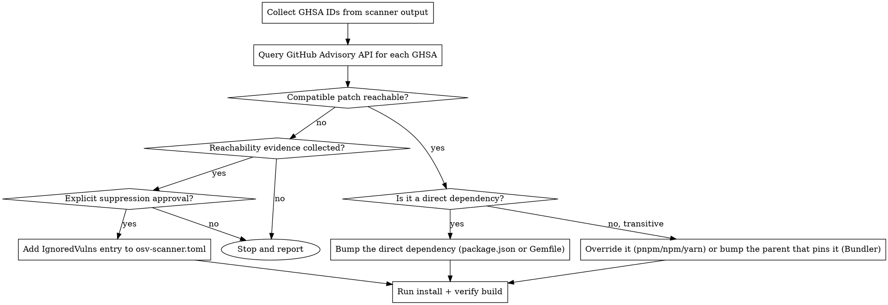

# Fix OSV Vulnerabilities

## Overview

For each reported GHSA, check if a patched version exists via the GitHub Advisory API.
If a patch exists → upgrade via package manager overrides or direct dependency bump; where the manager has no overrides (Bundler), bump the parent that pins the vulnerable package.
If no compatible reachable patch exists → collect reachability evidence and request a suppression decision.

## Workflow


```dot
digraph fix_osv {
    "Collect GHSA IDs from scanner output" [shape=box];
    "Query GitHub Advisory API for each GHSA" [shape=box];
    "Compatible patch reachable?" [shape=diamond];
    "Reachability evidence collected?" [shape=diamond];
    "Explicit suppression approval?" [shape=diamond];
    "Is it a direct dependency?" [shape=diamond];
    "Bump the direct dependency (package.json or Gemfile)" [shape=box];
    "Override it (pnpm/npm/yarn) or bump the parent that pins it (Bundler)" [shape=box];
    "Add IgnoredVulns entry to osv-scanner.toml" [shape=box];
    "Run install + verify build" [shape=box];

    "Collect GHSA IDs from scanner output" -> "Query GitHub Advisory API for each GHSA";
    "Query GitHub Advisory API for each GHSA" -> "Compatible patch reachable?";
    "Compatible patch reachable?" -> "Is it a direct dependency?" [label="yes"];
    "Compatible patch reachable?" -> "Reachability evidence collected?" [label="no"];
    "Reachability evidence collected?" -> "Explicit suppression approval?" [label="yes"];
    "Reachability evidence collected?" -> "Stop and report" [label="no"];
    "Explicit suppression approval?" -> "Add IgnoredVulns entry to osv-scanner.toml" [label="yes"];
    "Explicit suppression approval?" -> "Stop and report" [label="no"];
    "Is it a direct dependency?" -> "Bump the direct dependency (package.json or Gemfile)" [label="yes"];
    "Is it a direct dependency?" -> "Override it (pnpm/npm/yarn) or bump the parent that pins it (Bundler)" [label="no, transitive"];
    "Bump the direct dependency (package.json or Gemfile)" -> "Run install + verify build";
    "Override it (pnpm/npm/yarn) or bump the parent that pins it (Bundler)" -> "Run install + verify build";
    "Add IgnoredVulns entry to osv-scanner.toml" -> "Run install + verify build";
}
```

## Step 1 — Collect the alerts

If the repo has Dependabot enabled, one call gets every open alert with its advisory data already joined — prefer this over scraping scanner output:

```bash
gh api --paginate repos/<owner>/<repo>/dependabot/alerts \
  --jq '.[] | select(.state=="open") | {ghsa: .security_advisory.ghsa_id, pkg: .dependency.package.name, scope: .dependency.scope, severity: .security_advisory.severity, range: .security_vulnerability.vulnerable_version_range, patched: .security_vulnerability.first_patched_version.identifier}'
```

`--paginate` is not optional. Without it the endpoint returns only the first 30 alerts, oldest first, and the result looks like a complete list: 505 open alerts once read as ~110. In a polling loop it is worse than incomplete — every newly filed alert lands on a page you never fetch, so the watch goes silently blind.

To look up a single GHSA (e.g. one that came from `osv-scanner` output):

```bash
gh api advisories/GHSA-XXXX-XXXX \
  --jq '"\(.ghsa_id) [\(.severity)] \(.summary)", (.vulnerabilities[] | "    \(.package.name): affected=\(.vulnerable_version_range)  patched=\(.first_patched_version // "NO PATCH")")'
```

Key field: `first_patched_version` — if present, a safe version exists.

Two shape gotchas that will bite you:

- On the **advisories** endpoint `first_patched_version` is a plain **string**; on the **dependabot/alerts** endpoint it is an **object** with an `.identifier` key. Using the wrong one fails with `expected an object but got: string`.
- One advisory often lists **several** `vulnerabilities` entries — one per affected major line (e.g. `<= 7.29.0 → 7.29.6` and `>= 8.0.0-alpha.0, < 8.0.0-rc.5 → 8.0.0-rc.6`). Pick the entry matching the major you are actually on; do not grab the first one and jump a major.

Do not pipe `curl` into `python3`/`node` to parse this — the `dangerous-command-guard` hook blocks piping downloaded content into an interpreter. `gh api --jq` avoids the problem entirely.

## Step 2a — Patch available: apply upgrade

### Transitive dependency (pnpm)

Add or update `overrides` in **`pnpm-workspace.yaml`** at the repo root — not `package.json`:

```yaml
overrides:
  "@babel/core": "^7.29.6" # GHSA-XXXX-XXXX
  package-name: "^<patched-version>" # GHSA-YYYY-YYYY
```

Current pnpm **ignores the `pnpm` field in `package.json`** and only warns:

```log
[WARN] The "pnpm" field in package.json is no longer read by pnpm.
The following keys were ignored: "pnpm.overrides". See https://pnpm.io/settings
```

That warning is easy to miss in install output, and the install then "succeeds" having changed nothing — always confirm the resolved versions (below) rather than trusting a clean exit code.
Verified on pnpm 11.13.0 (2026-07-19); older pnpm 9/10 did read `pnpm.overrides` from `package.json`, so check `pnpm --version` if a repo still uses the old layout.

Annotate each entry with its GHSA id so a future reader knows when the override can be dropped.

Use `^<patched-version>` so pnpm resolves to the latest compatible patch — often ends up installing a newer safe release.
Note that for `0.x` packages `^0.28.1` means `>=0.28.1 <0.29.0`, which is still the right choice.

For npm: use `"overrides"` in `package.json` (npm 8+).
For yarn: use `"resolutions"` in `package.json`.

### Several majors of the same package

One "highest patched version" per package name is wrong whenever the tree holds several majors of that package — the override either drags old consumers across a breaking boundary, or hides a reachable fix behind an unreachable one.
Match each advisory's `vulnerable_version_range` against the versions **actually installed**, and take the highest patch within each installed major.

- **Write one entry per major, never a merged one.** pnpm and yarn berry accept major-scoped selectors: `minimatch@3: ^3.1.4` _and_ `minimatch@9: ^9.0.7`. A blanket `undici: ^6.27.0` once silently downgraded a pinned `undici@7.28.0`.
- **The inverse bites too.** Keeping only the maximum patched version can discard the actionable fix: `fast-xml-parser` had advisories patched at 4.5.4/4.5.5 (reachable from the installed 4.5.3) plus one whose only fix is 5.7.0. Because the `< 5.7.0` range also matches 4.5.3, deduping to the max threw away the reachable 4.x fixes and four alerts stayed open until the override was scoped to `fast-xml-parser@4`.
- **Yarn classic (v1) does support scoped overrides** — the key is the literal dependency chain from `yarn why <pkg>`, e.g. `"glob/minimatch/brace-expansion": "^2.1.3"`. A flat unscoped key is dangerous here because yarn classic merges every semver request for that name into one resolution. The tell is a single lockfile stanza carrying combined ranges (`^1.1.17, ^2.0.2, ^5.0.5`) — that means the override leaked across majors, so revert and re-scope.
- **Preserve the lockfile by default.** An incremental install after editing `resolutions` can leave a stale stanza untouched. Do not delete or replace the lockfile during routine triage. A fresh regeneration can change unrelated resolutions. Require explicit approval before an isolated fresh regeneration in a clean worktree.
- **When two majors have incompatible export shapes, do not force one onto the other.** `brace-expansion` 2.x is `module.exports = expandTop` while 5.x is `{ expand }`. If no compatible reachable patch exists, continue to Step 2b. Do not add an `[[IgnoredVulns]]` entry before collecting the required evidence and obtaining explicit approval.
- **Below 1.0.0 the boundary is the minor, and below 0.1.0 the patch.** `^0.4.2` admits `< 0.5.0`, so an advisory whose only fix is `0.5.0` is a boundary crossing, not a patch bump — the same class of move as 4.x → 5.x, however small the numbers look. Triage that compares majors alone reads it as mechanical and hands you a breaking override: `decode-uri-component` `<= 0.4.2` patched at `0.5.0` was classified `patch-in-major` because both majors are 0, and the resulting resolution forced the ESM-only 0.5.0 onto `query-string@7.1.3`, which is CommonJS and does `require('decode-uri-component')` on line 3 (receipt-scraper PR #9, 2026-09-05, caught as a P1 by hosted review and reverted). Compare the line a caret actually stops at, not the major.
- **When you do force a version across a boundary, prove the consumer can load it — resolving is not loading.** Read the target's `package.json` for `"type"` and its `exports` map, then load it from the consumer's own resolution path with `require` for CommonJS or `import()` for ESM, and call what the consumer calls. `uuid` 7 → 11 in receipt-evidence looked like the same four-major jump, but `uuid@11.1.1` keeps a `require` condition pointing at a CommonJS build, and the probe from `xcode@3.0.1`'s directory resolved `uuid@11.1.1/dist/cjs/index.js` with `v1`/`v3`/`v4`/`v5` all functions and `v4()` returning a valid identifier. Same shape, opposite verdict — which is why the probe decides it and a version comparison does not. In pnpm the consumer's path is `node_modules/.pnpm/<consumer>@<version>/node_modules/<consumer>`; requiring from the workspace root resolves nothing.

Verify per major, without truncation: re-run `yarn why` / `pnpm why` and diff the lockfile for each major line.

Use the package manager's normal install only when an approved dependency change needs a lockfile update.
Treat a fresh regeneration from no lockfile as a separate operation that requires explicit approval.

### Direct dependency

Bump the version in the relevant workspace `package.json` directly:

```json
"devDependencies": {
  "vite": "^7.3.2"
}
```

### Transitive dependency pinned by a parent (Bundler)

Bundler has no overrides, so a transitive gem moves only when the gem that requires it allows the move.
In `Gemfile.lock` the parent's requirement is the indented line under the parent's own entry (`rubyzip (>= 2.0.0, < 3.0.0)` under `fastlane (2.238.0)`); if it excludes the patched version, `bundle update <gem>` cannot reach the fix.

Find the first parent release whose requirement admits the patch.
List every stable release oldest first, then query each one above the locked version until the requirement changes:

```bash
gh api -X GET https://rubygems.org/api/v1/versions/<parent>.json --jq '[.[] | select(.prerelease | not) | .number] | reverse | .[]'
gh api -X GET https://rubygems.org/api/v2/rubygems/<parent>/versions/<version>.json \
  --jq '.ruby_version, (.dependencies.runtime[] | select(.name=="<gem>") | .requirements)'
```

Do not cut the list short: the endpoint returns every release (570 stable ones for `fastlane` on 2026-09-30), and the transition can sit anywhere above the locked version.
Keep reading past the first release that admits the patch, because a later one can tighten the requirement again, and the release you finally resolve to is the one that has to admit it.

GHSA-47m2-wp7j-p9vc (`rubyzip < 3.4.0`) was held by `fastlane` 2.238.0 and 2.239.0 at `< 3.0.0`; `fastlane` 2.240.0 raised its own requirement to `>= 3.4.0, < 4.0.0`, so the fix was a parent bump with no Gemfile edit.
If no parent release admits the patch, continue to Step 2b.

Move the parent and the vulnerable gem together, and resolve without installing:

```bash
BUNDLE_GEMFILE=/abs/path/Gemfile bundle lock --update <parent> <gem> --conservative
```

Name both. A parent whose new requirement admits the patch but still admits the locked vulnerable version (`>= 2.0.0, < 4.0.0` instead of `>= 3.4.0`) leaves the gem where it is when only the parent is named, because `--conservative` holds every gem not on the command line at its locked version unless a requirement forces it off.
The fastlane case needed only the parent because 2.240.0 forced `rubyzip` off 2.4.1; do not rely on that.
It does not stop the parent at the release found above: `--update` defaults to `--major`, so the parent moves to the newest release the Gemfile admits (the fastlane case landed on 2.240.1, not 2.240.0).
Read which versions the lockfile now names, for the parent and for the gem, and check those releases, not the ones you selected.
If the newest release is further than you want to go, narrow the Gemfile's constraint on the parent to the selected release (`gem "fastlane", "~> 2.240.0"`) before running the command; `--patch` or `--minor` with `--strict` cap the update by semver level, not at a named release.
If the Gemfile's own constraint on the parent excludes the target release, that is a direct-dependency bump: edit the Gemfile first.

- **Every lockfile is a separate alert and a separate fix.** A mobile app can carry one Gemfile per platform (`android/Gemfile` and `ios/Gemfile`, each only for fastlane), so the same GHSA arrives twice. Update each; compare the two lockfiles afterwards, since they should differ only where the Gemfiles do.
- **Read the diff for what else moved.** A parent bump carries its other requirement changes with it (the fastlane bump above also added `cgi` and moved `security` 0.1.5 → 0.3.0, which is a boundary crossing under the 0.x rule above).
- **Check the Ruby floor.** Compare the `ruby_version` of every gem the lockfile moved against each place that picks the Ruby: `.ruby-version`, a `RUBY VERSION` section in the lockfile, and `ruby-version` in any CI workflow that runs the tool.
- **Load it, then say what did not run.** After `bundle install`, confirm the resolved version with `grep -n '^    <gem> (' <each Gemfile.lock>` and load it through the bundle by the path its consumers require, which need not be the gem name (`BUNDLE_GEMFILE=… bundle exec ruby -e 'require "zip"'` for `rubyzip`; 2.x ships no `rubyzip.rb`, so `require "rubyzip"` is a `LoadError` there and loads only from 3.x). `fastlane lanes` proves only that the Fastfile parses; the actions that use the moved gem (uploads, archive handling, keychain access) run only in a real lane, which has external impact, so report them as unexercised instead of running one.

### Apply and verify

```bash
pnpm install --no-frozen-lockfile   # Changing overrides is a lockfile config change
pnpm build                          # Confirm build passes
```

`--no-frozen-lockfile` is required: with `CI=true` (or on CI) a plain `pnpm install` aborts with `ERR_PNPM_LOCKFILE_CONFIG_MISMATCH` because the new `overrides` block does not match the one recorded in the lockfile.
Prefixing `CI=true` also avoids `ERR_PNPM_ABORTED_REMOVE_MODULES_DIR_NO_TTY` when pnpm wants to purge `node_modules` in a non-interactive shell.

Confirm the resolved versions are ≥ the patched versions — this is the real proof the fix landed, not the install exit code:

```bash
pnpm why <pkg-a> <pkg-b> --depth 1
```

Watch the `Found N versions of <pkg>` line: an override that worked usually collapses a package to a **single** version by pulling a parent off its exact pin.

Map each override to a check that actually executes it, rather than assuming `pnpm build` covers everything:

| Override lives in                    | Exercised by                                    |
| ------------------------------------ | ----------------------------------------------- |
| CSS pipeline (postcss, autoprefixer) | `pnpm build`                                    |
| Lint/AST tooling (`@babel/core`)     | `pnpm lint` — a Next build uses SWC, not Babel  |
| Script runner (`esbuild` via tsx)    | the test/script command that runs through `tsx` |

Gotcha: `trunk check`'s osv-scanner cache can report a false green after edits — `touch` the lockfiles to bust the cache before trusting a clean run (Dependabot is the independent oracle when in doubt).

To make that green fail first on the pre-fix tree, pass `--show-existing` and read the output, not the exit code.
Trunk holds the line against upstream, so a vulnerability already on the base branch is an "existing issue": in a worktree of the pre-fix commit, `trunk check --no-fix --filter=osv-scanner Gemfile.lock` printed `1 existing issue` and `✔ No new issues` and exited 0; only `--show-existing` printed the GHSA line, and that run exited 0 too.
Pin the pre-fix tree by SHA (`git worktree add --detach <dir> <sha>`), never `HEAD`: a parallel commit can move `HEAD` past the fix between two commands, and a "pre-fix" copy taken from it is already fixed and scans clean for the right reason.

## Step 2b — No compatible reachable patch: request a suppression decision

Find the osv-scanner config file — osv-scanner auto-discovers config ADJACENT to the scanned lockfile, so placement matters:

- Check for an `osv-scanner.toml` next to the lockfile that produced the finding first (e.g. `example/osv-scanner.toml` for `example/Gemfile.lock` — a root or `.trunk/configs` copy will NOT be picked up for that lockfile)
- Then `osv-scanner.toml` in the project root
- Fall back to `.trunk/configs/osv-scanner.toml`

Do not add an `[[IgnoredVulns]]` entry by default.
First collect reachability evidence for the installed package and each affected usage.
Then obtain explicit approval for the suppression.
The approval must name the GHSA and the affected package version.

After approval, append an `[[IgnoredVulns]]` entry that records the evidence, date, reason, and reevaluation owner:

```toml
[[IgnoredVulns]]
id = "GHSA-XXXX-XXXX"
reason = "<package>@<version> has no compatible reachable patch as of <YYYY-MM-DD>. Reachability evidence: <command and result>. Approved by <name> on <YYYY-MM-DD>. Re-evaluation owner: <name or team> checks when a compatible patch is released."
```

Do not suppress a reachable vulnerability because it is inconvenient to update.

## Cleanup

Once an override is in place, remove any `[[IgnoredVulns]]` entries for the same GHSA that are no longer needed.

If an override was previously set to pin an older version for a GHSA that was "no patch available" at the time, update both the override and remove the ignore entry.

## Common Mistakes

| Mistake                                                   | Fix                                                                                               |
| --------------------------------------------------------- | ------------------------------------------------------------------------------------------------- |
| Putting pnpm `overrides` in `package.json`                | Current pnpm only reads them from `pnpm-workspace.yaml` — it warns, then silently changes nothing |
| Trusting a clean `pnpm install` exit code                 | Verify with `pnpm why <pkg> --depth 1` that the resolved version is ≥ patched                     |
| Assuming the lock file auto-updates                       | Always run `pnpm install --no-frozen-lockfile` after editing overrides                            |
| Setting override to exact version (`"3.1.4"`)             | Use `"^3.1.4"` — lets pnpm pick latest safe patch                                                 |
| Adding `IgnoredVulns` before reachability evidence         | Collect the dependency path and affected usage first, then obtain explicit approval               |
| Fresh-regenerating a lockfile without approval             | Preserve it by default; use an approved isolated regeneration only when needed                    |
| Leaving stale `[[IgnoredVulns]]` after patching           | Remove the entry when upgrading the override                                                      |
| Checking latest published version instead of advisory     | Use the GitHub Advisory API — npm dist-tags don't encode CVE fix info                             |
| Taking the first `vulnerabilities[]` entry in an advisory | Multiple entries = multiple major lines; match the major you are on                               |
| Assuming `pnpm build` validates every override            | Lint/script-only deps need `pnpm lint` / the `tsx` command to be exercised                        |
| One override per package name when several majors exist   | Scope per major (`minimatch@3` and `minimatch@9`); a merged key downgrades or breaks a consumer   |
| Deduping advisories to the highest patched version        | The unreachable fix hides the reachable one — scope to the installed major                        |
| Listing Dependabot alerts without `--paginate`            | Truncates at 30, oldest first, and reads as a complete list                                       |

## Provenance

The multi-major scoping section began as a standing rule and was folded in here instead: it only ever fires during the dependency triage this skill already owns, so as an always-loaded rule it spent context in every session to be useful in a few.
The cases behind it were real ones — an `undici` downgrade that resolved to an unreachable major, `minimatch` present at both 3 and 9 in one tree alongside `ajv`, `path-to-regexp`, `brace-expansion`, `body-parser`, `picomatch` and `form-data` in the same shape, and yarn-classic nested paths that the flat override never reached.
